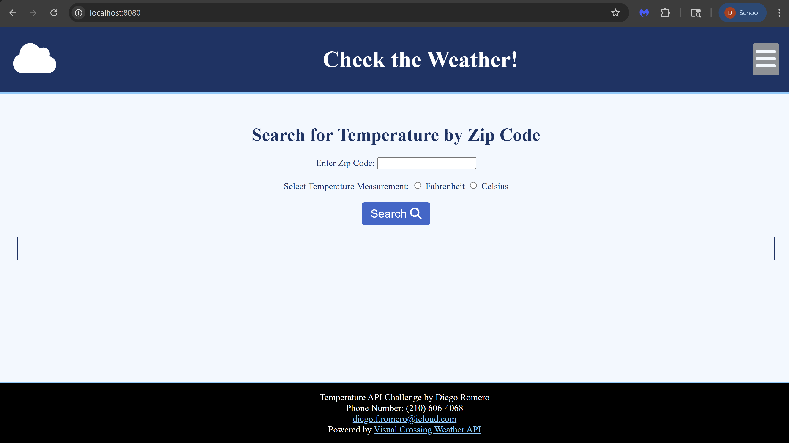
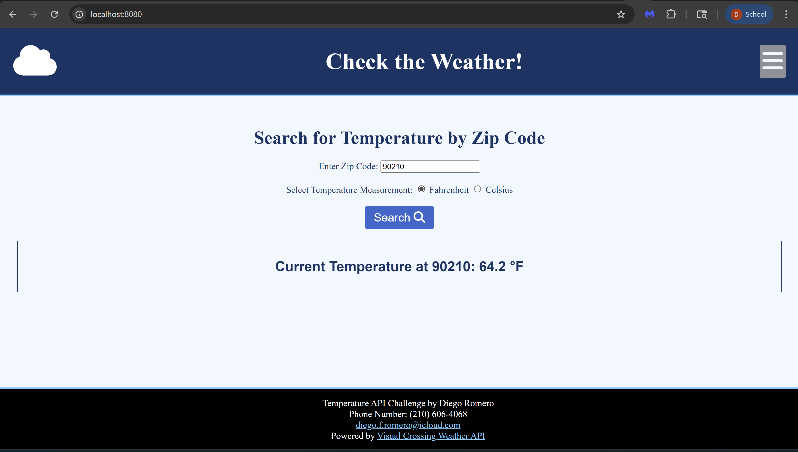
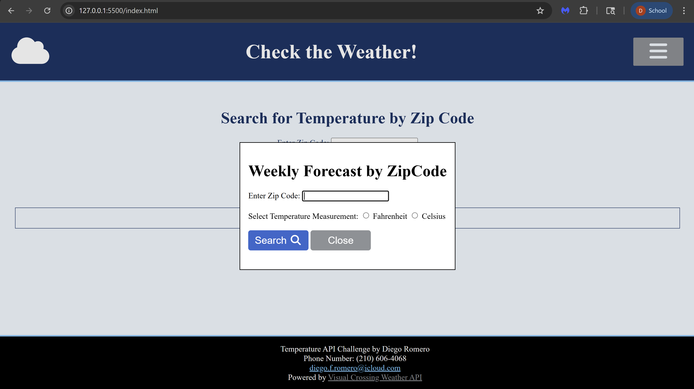
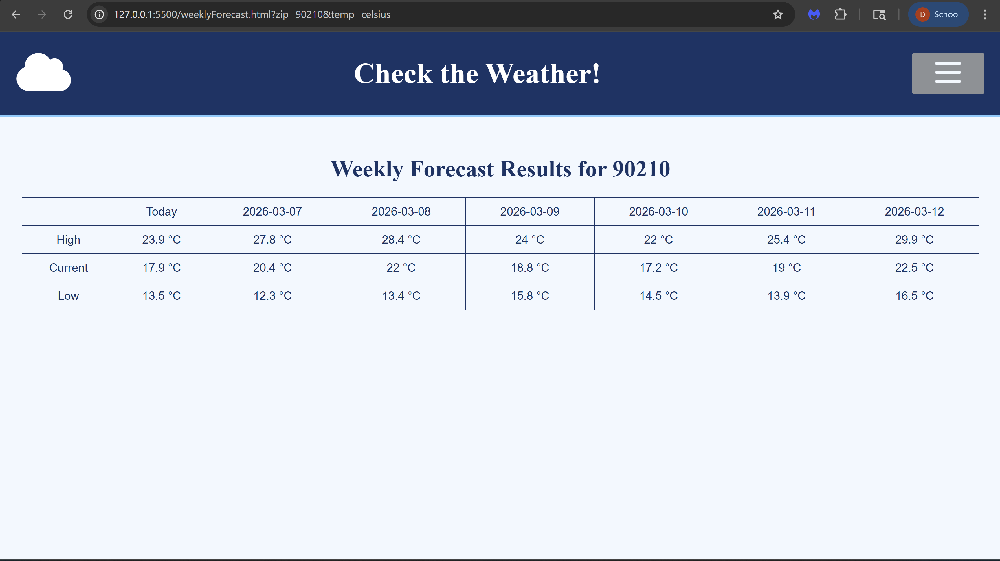

# Temperature API Challenge By Diego Romero
This is a simple web application that will query Visual Crossing's Weather API for information about
the current temperature. The User is able to input the desired zipcode and whether they want the local temperature in fahrenheit or celsius.

## AI Usage Statement
I, Diego Romero, certify that ChatGPT was used in the development of this web application. 
ChatGPT was used for generating the TemperatureStyle.css file with styles.
It was also used for bug fixing code in index.html, weeklyForecast.html, apiController.js, and dialogueController.js. During which, it output code snippets for the dialoge window, weeklySearchForm event listener in dialogueController.js, performWeeklySearch in apiController.js, and links in the head section of both html files to support font-awesome icons.

## How to Use
Download the files in a code editor, preferably VSCode, either by the zip file sent in the email, or by running:

git clone https://github.com/D1egoR0mero/Websites.git

After downloading the files, run npm install to download all packages listed in package.json

When npn install is finished, run npm start.

Then, open a browser window, and enter http://localhost:8080/

This window should now be visible

Most people associate weather with the colors of the sky: white, blue, and gray.
The landing page has the application ready for the user to input their queries because users want to log into a website and get to why they clicked quickly.

Enter a 5 digit ZipCode, select Fahrenheit or Celsius
and click search to get the current temperature from Visual Crossing's Weather API

Morever, hovering over the Hamburger menu shows Two Options: Home and Weekly Forecast.
Clicking Home takes you to index.html, the home page. Clicking Weekly Forecast displays a dialoge window with the same parameters as the home page. I designed it this way because the I wanted to keep individual data and weekly data separate. Moreover, the popup falls in line with the 3 click rule, where users can access any part of a website within 3 clicks from anywhere in the site.

Enter a 5 digit ZipCode, select Fahrenheit or Celsius
and click search to get the current weekly temperature information from Visual Crossing's Weather API

